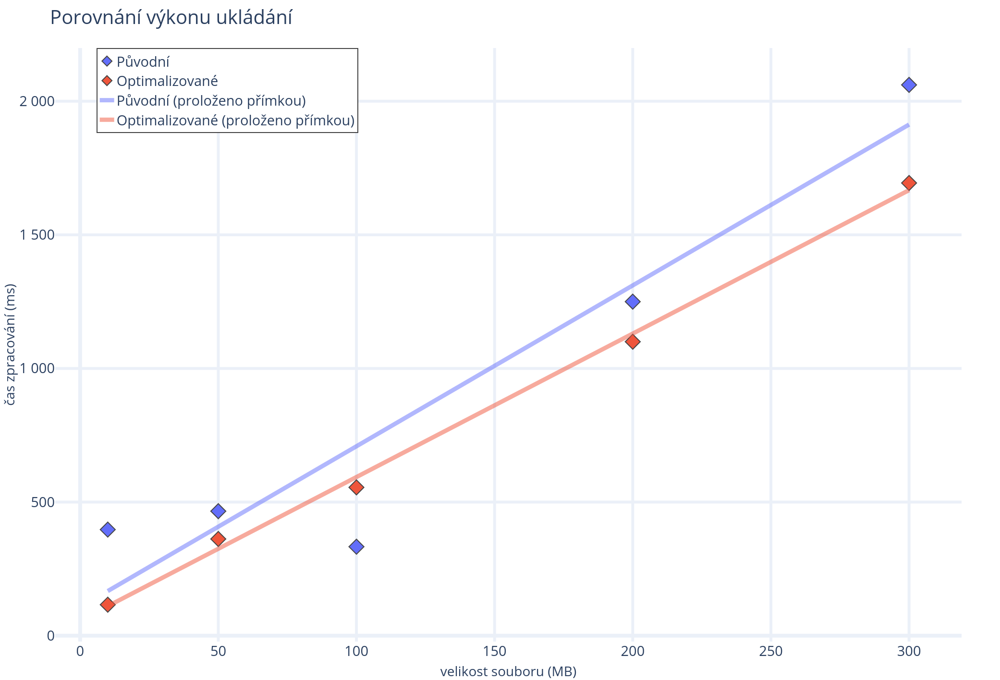
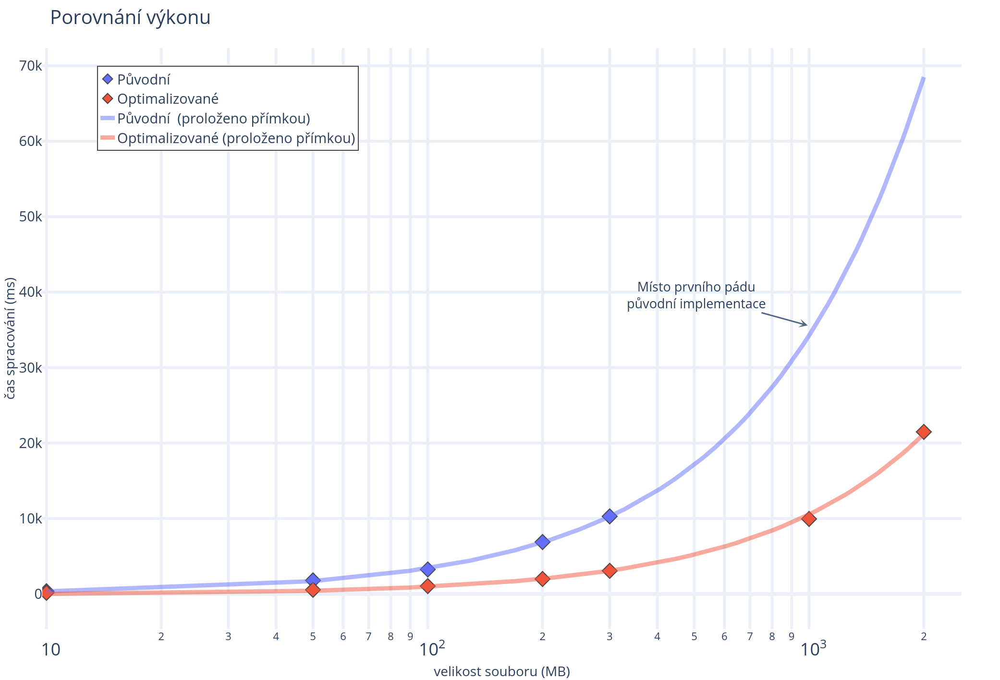

# A core of banchelor thesis of Bc. Josef Havranek DiS.

Code in this repository is a core of work of me author of this repository
Bc. Josef Havranek DiS. a Banchelor thesis. Topic of this thesis was a Optimalization and refactoring of [DNA analyser](http://git.pef.mendelu.cz/bioinformatics/dna-analyser/)
Its purpose is prepocesing of FASTA and plain (only nucleic character as ACTGU etc.) sequences.
it was part of procesing of uploaded files (during upload and in batch later)

## About code
Code has been partialy redacted since it is not oficialy open source
but what it here is sensible cutdown version of code(with alowance )
it only contains things that are related
all package names was redacted. Everything i wrote compleetly
or clases that i changed and it had big inpact on speed was denoted with
  `not redacted` and vere not redacted.

Code was put publicly as demonstration of my abilities and as tribute 
to scientific comunity for further use outside of my school. 
It contains as far as I know only format extensible multithreaded preprocesor of DNA sequences in Java with most likely fastest vectorizing DNA string uppercaser in Java. Faster than comon implementation of  `string.toUppercase()`  (with proof)

It even employ cash size to improve cache hit ratio since chunks of data are read/writen multiple times.. not dooing so had regresive efect on speed (unrecorded).

it also implements custom spinlock since it was faster (unrecorded)

## noteworthy (unredacted) code
* [THE preprocesor](./src/inport/RawDataProcessor.java) that contains fast uppercaser and paralel preprocesor of data
* [Parallel nucleic counter](./src/inport/NucleicCounterService.java) with custom spinlock
* [Pre-PreProcesor and datastorage handling](./src/data/SequenceDataRepository.java) this is where uploaded data goes first this is where "cache aligning" happens
* [Streamed database downloader](.NCBISequenceService.java) allows process data swiftly from external NCBI database.

## UppercaserSpeed
Time of uppercaser mesured with visualVM with profiling   
on 2 cores 4 thread i5-7200U with 3.1GHZ

**note:** Even time seems miniscule this will mater when you account that
DNA sequences can go up to 2GB (currently longest chromosome is a chromosome of Axolotl Mexicana)

| Size/Version | string.toUpperCase() |   Custom  |
|:------------:|:--------------------:|:---------:|
|      MB      |       time (ms)      | time (ms) |
|       3      |         18.1         |    12.7   |
|       5      |         29.4         |    17.4   |
|      10      |         63.3         |    35.2   |
|      50      |          364         |    163    |

## Achivements/graphs
speed up preprocesor by $3\times$

in all graphs blue is oreginal implementation

diamonds are mesurement
### Speed of pre-preprocesor

### speed of preprocesor
arrow indicate crash of oreginal implementation

